# BFF Gateway — Routing & JWT Architecture

## Table of Contents

1. [System Overview](#1-system-overview)
2. [Service Port Map](#2-service-port-map)
3. [Two Routing Approaches](#3-two-routing-approaches)
4. [Gateway Routes (Spring Cloud Gateway MVC)](#4-gateway-routes-spring-cloud-gateway-mvc)
5. [Custom Proxy Routes (RestClient-Based)](#5-custom-proxy-routes-restclient-based)
6. [Gateway vs Custom Proxy — Comparison](#6-gateway-vs-custom-proxy--comparison)
7. [Internal JWT — Signing & Structure](#7-internal-jwt--signing--structure)
8. [JWKS Endpoint & Key Management](#8-jwks-endpoint--key-management)
9. [Downstream JWT Validation (Users Service)](#9-downstream-jwt-validation-users-service)
10. [Authentication & Role-Based Permission Flow](#10-authentication--role-based-permission-flow)
11. [Session Management](#11-session-management)
12. [Request Headers & Correlation](#12-request-headers--correlation)
13. [Error Handling](#13-error-handling)
14. [Configuration Reference](#14-configuration-reference)

---

## 1. System Overview


The BFF Gateway is the single entry point for browser clients. It authenticates users via form login, manages sessions and roles, then proxies requests to downstream microservices. Every proxied request carries a **signed internal JWT** instead of session cookies.

---

## 2. Service Port Map

| Service            | Port   | Purpose                                    |
|--------------------|--------|--------------------------------------------|
| BFF Gateway        | `8080` | Authentication, routing, JWT signing       |
| Users Service      | `8081` | User data (real Spring Boot service)       |
| Orders Service     | `8082` | Order data (mock)                          |
| Notifications      | `8083` | Notifications (mock, custom proxy)         |
| Alerts             | `8084` | Alerts (mock, custom proxy)                |
| Config Service     | `8085` | Role permission configuration (mock)       |

---

## 3. Two Routing Approaches

The BFF implements **two distinct routing mechanisms** side by side:

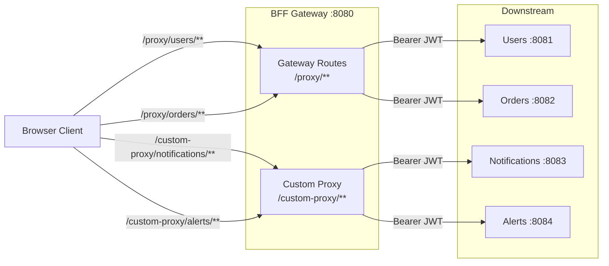

| Aspect               | Gateway Routes (`/proxy/**`)                             | Custom Proxy (`/custom-proxy/**`)                       |
|----------------------|----------------------------------------------------------|---------------------------------------------------------|
| Implementation       | Spring Cloud Gateway MVC `RouterFunction`                | `@RestController` + `RestClient`                        |
| Defined in           | `GatewayRoutesConfig`                                    | `CustomProxyController` + `CustomProxyService`          |
| Filter mechanism     | `before()`/`after()` filter functions                    | Manual header building in service layer                 |
| Services routed      | Users, Orders                                            | Notifications, Alerts                                   |
| Path stripping       | Automatic via `stripPrefix(1)`                           | Manual via `CustomProxyUtils.buildTargetUri()`          |
| JWT injection        | `InternalJwtRelayFilter`                                 | `CustomProxyService` calls `InternalJwtService` directly|
| Error handling       | Gateway framework + `GlobalExceptionHandler`             | Try/catch in `CustomProxyService` + `GlobalExceptionHandler` |

Both approaches produce the **same outbound request** to downstream services: a request with `Authorization: Bearer <jwt>`, `X-APP-User`, and `X-Correlation-Id` headers.

---

## 4. Gateway Routes (Spring Cloud Gateway MVC)

### Route Registration

Routes are defined as `RouterFunction` beans in `GatewayRoutesConfig`:

```java
route("users-service-route")
    .route(RequestPredicates.path("/proxy/users/**"), http())
    .before(internalJwtRelayFilter.asBeforeFunction())   // inject JWT
    .before(stripPrefix(1))                               // /proxy/users/123 → /users/123
    .before(uri(usersServiceUri))                         // set target base URI
    .after(proxyResponseHeadersFilter.asAfterFunction("users-service-route"))
    .build();
```

### Request Processing Pipeline

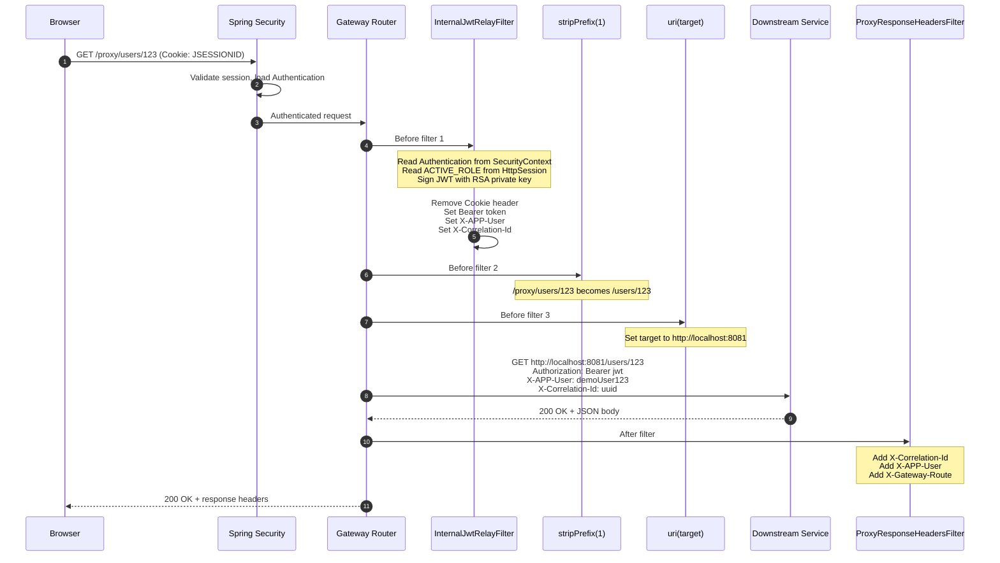

### InternalJwtRelayFilter Responsibilities

1. **Authentication check** — rejects unauthenticated/anonymous requests with `401`
2. **Session read** — reads `ACTIVE_ROLE` from `HttpSession`
3. **JWT creation** — calls `InternalJwtService.createToken(auth, clientIp, activeRole)`
4. **Header replacement** — removes `Cookie`, sets `Authorization: Bearer <jwt>`, `X-APP-User`, `X-Correlation-Id`

### ProxyResponseHeadersFilter Responsibilities

Adds traceability headers to downstream responses before returning to browser:
- `X-Correlation-Id`
- `X-APP-User`
- `X-Gateway-Route` (identifies which route was used)

---

## 5. Custom Proxy Routes (RestClient-Based)

### Architecture

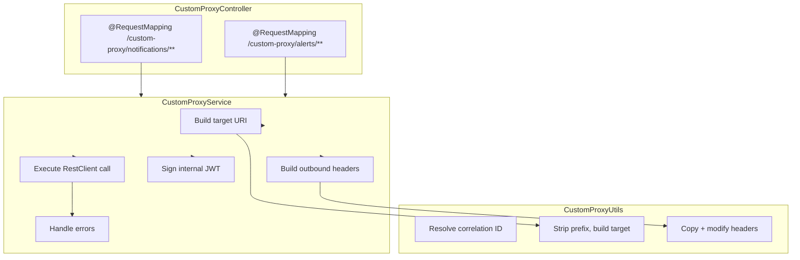

### Request Flow

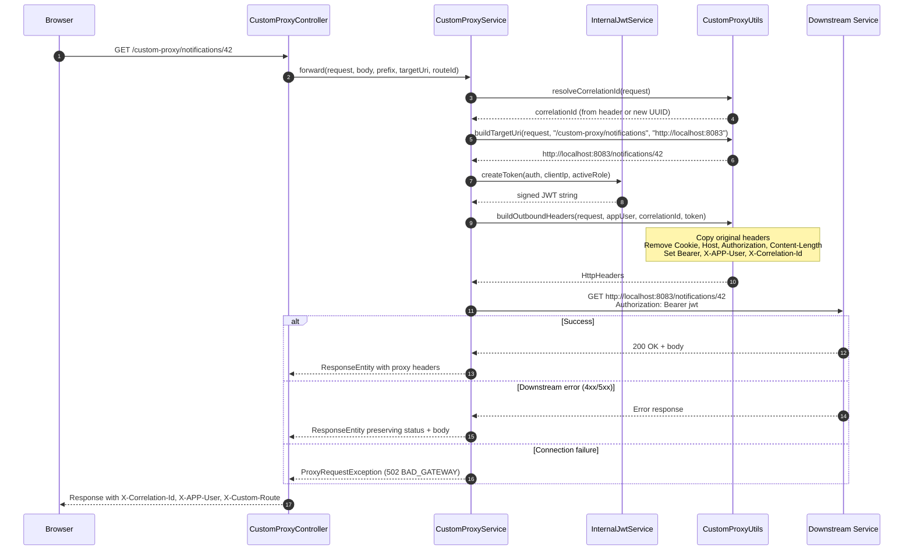

### Path Transformation

```
Request:  /custom-proxy/notifications/42?page=1
Prefix:   /custom-proxy/notifications
Target:   http://localhost:8083

Result:   http://localhost:8083/42?page=1
```

The `CustomProxyUtils.buildTargetUri()` method:
1. Strips the context path (if any)
2. Removes the route prefix from the request path
3. Appends the remaining path and query string to the target base URI

---

## 6. Gateway vs Custom Proxy — Comparison

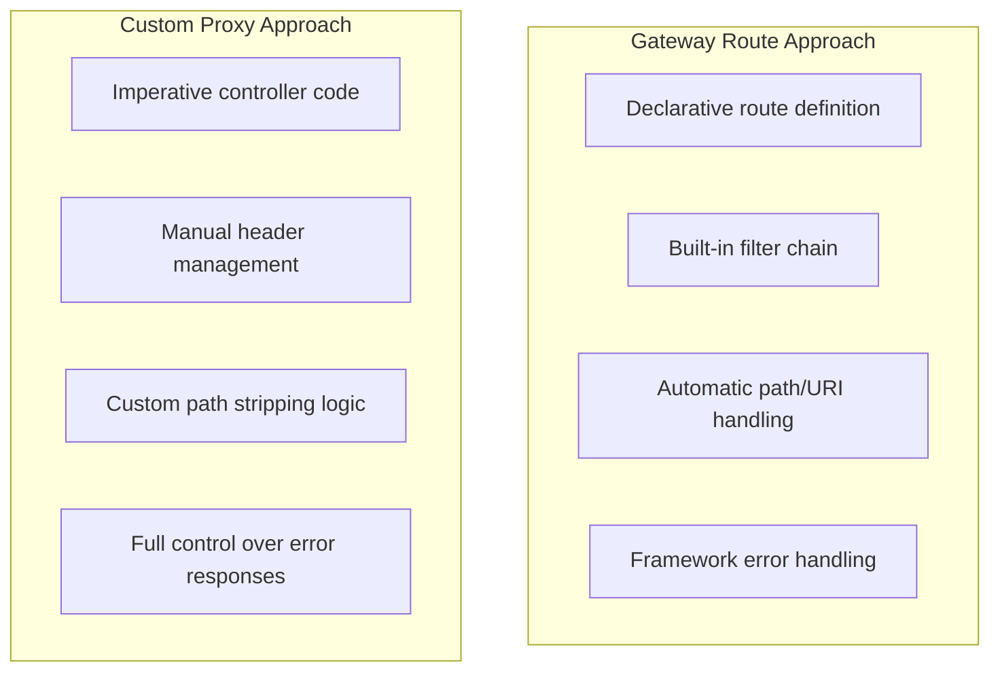

| When to use Gateway Routes           | When to use Custom Proxy                    |
|---------------------------------------|---------------------------------------------|
| Simple pass-through proxying          | Complex request/response transformation     |
| Standard filter chains are sufficient | Need to inspect or modify the body          |
| Want minimal boilerplate              | Need fine-grained error handling per route  |
| Upstream follows REST conventions     | Custom business logic during proxying       |

---

## 7. Internal JWT — Signing & Structure

### JWT Creation Flow

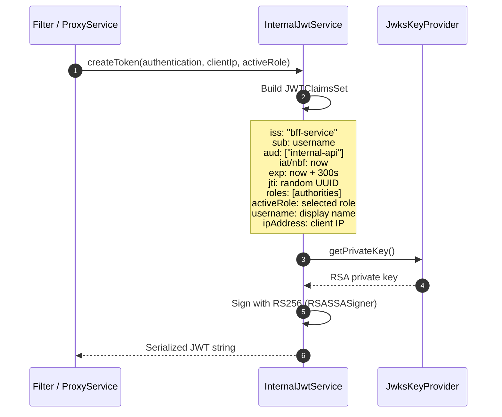

### JWT Claims Structure

```json
{
  "iss": "bff-service",
  "sub": "demoUser123",
  "aud": ["internal-api"],
  "iat": 1743350400,
  "nbf": 1743350400,
  "exp": 1743350700,
  "jti": "a1b2c3d4-e5f6-7890-abcd-ef1234567890",
  "roles": ["ROLE_USER", "dashboard.view", "orders.view", "orders.create"],
  "activeRole": "ROLE_USER",
  "username": "demoUser123",
  "ipAddress": "127.0.0.1"
}
```

### Key Properties

| Property     | Value                     | Purpose                                         |
|--------------|---------------------------|-------------------------------------------------|
| Algorithm    | RS256                     | RSA signature with SHA-256                      |
| Key ID (kid) | SHA-256 thumbprint        | Allows downstream JWKS key lookup               |
| TTL          | 300 seconds (5 min)       | Short-lived, one per proxied request            |
| Issuer       | `bff-service`             | Identifies the BFF as token source              |
| Audience     | `internal-api`            | Restricts token to internal services            |

### What Goes Into the `roles` Claim

The `roles` claim contains **all authorities** from the Spring Security `Authentication` object, which includes:
- Original role authorities (e.g. `ROLE_USER`, `ROLE_ADMIN`)
- Feature permission authorities added by `SecurityContextHelper` (e.g. `dashboard.view`, `orders.create`)

---

## 8. JWKS Endpoint & Key Management

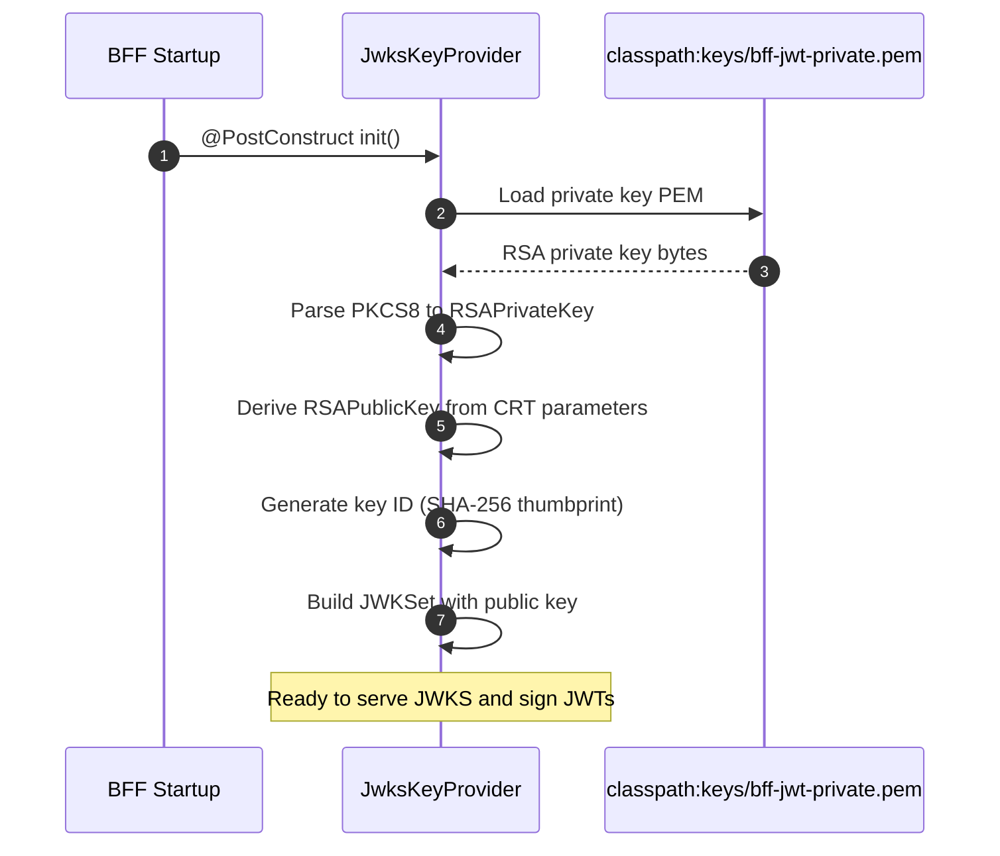

### JWKS Endpoint

**URL:** `GET /.well-known/jwks.json` (public, no authentication required)

**Response:**
```json
{
  "keys": [
    {
      "kty": "RSA",
      "kid": "<sha256-thumbprint>",
      "n": "<modulus>",
      "e": "AQAB"
    }
  ]
}
```

Downstream services (like Users Service) fetch this endpoint to obtain the public key for JWT signature verification.

### Key Lifecycle

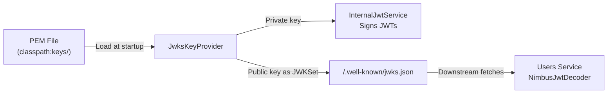

---

## 9. Downstream JWT Validation (Users Service)

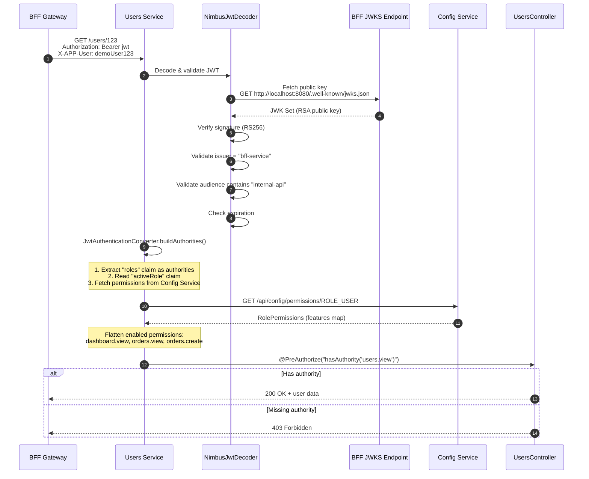

### Validation Steps

1. **Signature verification** — using public key fetched from BFF's JWKS endpoint
2. **Issuer validation** — must be `bff-service`
3. **Audience validation** — must contain `internal-api`
4. **Expiration check** — standard JWT `exp` check
5. **Authority building** — `JwtAuthenticationConverter` builds `GrantedAuthority` list from JWT claims + config-service permissions

### Authority Building in Users Service

The `buildAuthorities` method in the Users Service `SecurityConfig`:

```
JWT roles claim → SimpleGrantedAuthority per role
    e.g. ROLE_USER, ROLE_ADMIN

activeRole claim → fetch from config-service → flatten enabled permissions
    e.g. dashboard.view, orders.view, orders.create, users.view
```

These authorities are then checked by `@PreAuthorize` annotations on controller methods.

---

## 10. Authentication & Role-Based Permission Flow

### Single-Role User Login

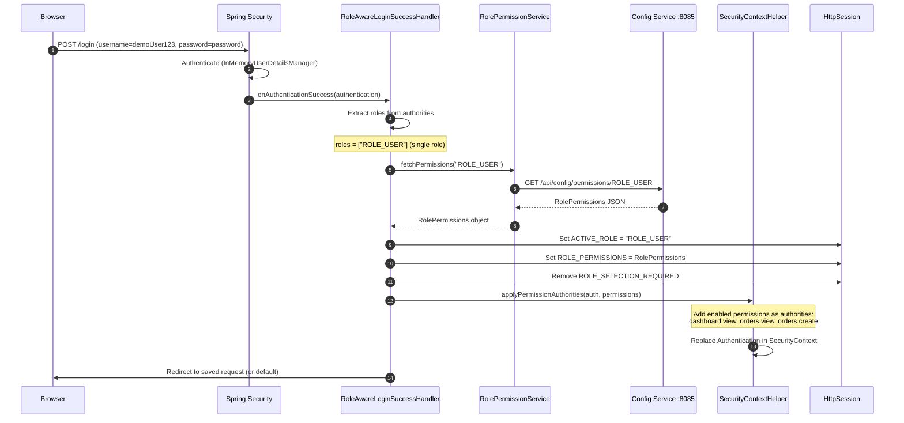

### Multi-Role User Login

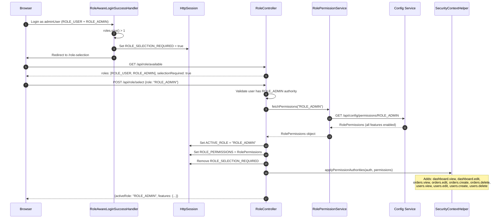

### Permission Structure from Config Service

```json
{
  "role": "ROLE_ADMIN",
  "features": {
    "dashboard": { "view": true, "edit": true },
    "orders":    { "view": true, "edit": true, "create": true, "delete": true },
    "users":     { "view": true, "edit": true, "create": true, "delete": true }
  }
}
```

**Flattened to authorities:** `dashboard.view`, `dashboard.edit`, `orders.view`, `orders.edit`, `orders.create`, `orders.delete`, `users.view`, `users.edit`, `users.create`, `users.delete`

Only permissions with `value = true` are added as authorities.

---

## 11. Session Management

### Session Attributes

| Key                      | Type               | Set When                        | Purpose                              |
|--------------------------|--------------------|---------------------------------|--------------------------------------|
| `ACTIVE_ROLE`            | `String`           | Login (single role) or `/api/role/select` | Currently active role         |
| `ROLE_PERMISSIONS`       | `RolePermissions`  | Same as above                   | Full permission map for active role  |
| `ROLE_SELECTION_REQUIRED`| `Boolean`          | Login (multi-role)              | Signals frontend to show role picker |

### Session Flow

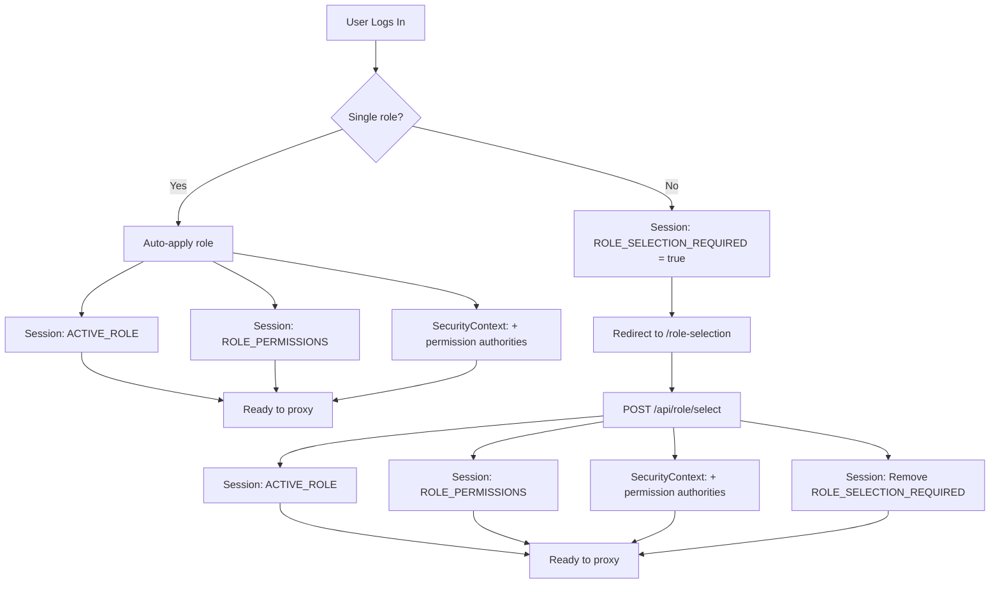

---

## 12. Request Headers & Correlation

### Outbound Headers (BFF → Downstream)

| Header              | Value                          | Set By                          |
|---------------------|--------------------------------|---------------------------------|
| `Authorization`     | `Bearer <signed-jwt>`          | JWT relay filter / proxy service |
| `X-APP-User`        | Authenticated username          | JWT relay filter / proxy service |
| `X-Correlation-Id`  | UUID (from request or generated)| JWT relay filter / proxy service |

### Response Headers (Downstream → Browser)

| Header              | Value                          | Set By                          |
|---------------------|--------------------------------|---------------------------------|
| `X-Correlation-Id`  | Same as request                 | Response filter / proxy service |
| `X-APP-User`        | Authenticated username          | Response filter / proxy service |
| `X-Gateway-Route`   | Route ID (gateway routes)       | `ProxyResponseHeadersFilter`    |
| `X-Custom-Route`    | Route ID (custom proxy)         | `CustomProxyService`            |
| `X-Proxy-Mode`      | `"custom"` (custom proxy only)  | `CustomProxyUtils`              |

### Correlation ID Flow

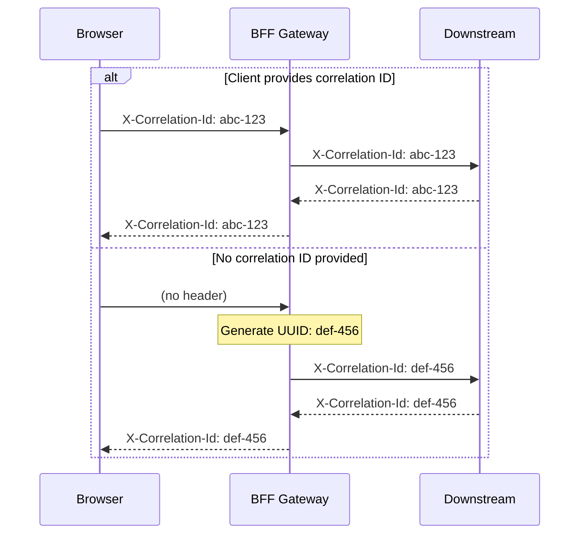

---

## 13. Error Handling

### Error Flow

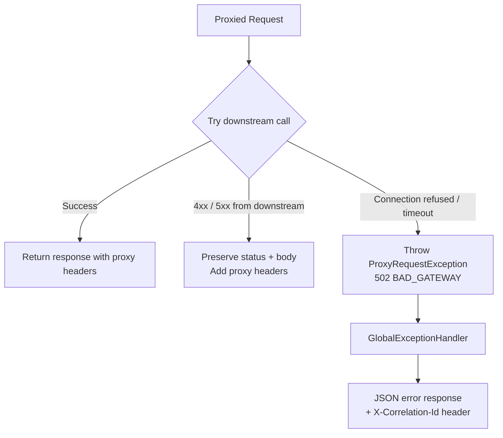

### Error Response Format

```json
{
  "timestamp": "2026-03-28T10:30:00Z",
  "status": 502,
  "error": "Bad Gateway",
  "message": "Custom proxy target is unavailable for route notifications-custom-route",
  "path": "/custom-proxy/notifications/42",
  "correlationId": "abc-123"
}
```

---

## 14. Configuration Reference

### BFF Gateway (`application.yml`)

```yaml
server:
    port: 8080

app:
    internal-jwt:
        issuer: bff-service              # JWT issuer claim
        audience: internal-api           # JWT audience claim
        ttl-seconds: 300                 # JWT lifetime (5 minutes)
        private-key-location: classpath:keys/bff-jwt-private.pem

    config-service:
        base-url: http://localhost:8085  # Role permission source

    downstream:
        users: http://localhost:8081         # Gateway route target
        orders: http://localhost:8082        # Gateway route target
        notifications: http://localhost:8083 # Custom proxy target
        alerts: http://localhost:8084        # Custom proxy target
```

### Users Service (`application.yml`)

```yaml
server:
    port: 8081

app:
    security:
        jwt:
            jwks-uri: http://localhost:8080/.well-known/jwks.json  # BFF public key
            issuer: bff-service                                     # Must match BFF issuer
            audience: internal-api                                  # Must match BFF audience
    config-service:
        base-url: http://localhost:8085  # Role permission source (independent fetch)
```

### Key Configuration Relationships

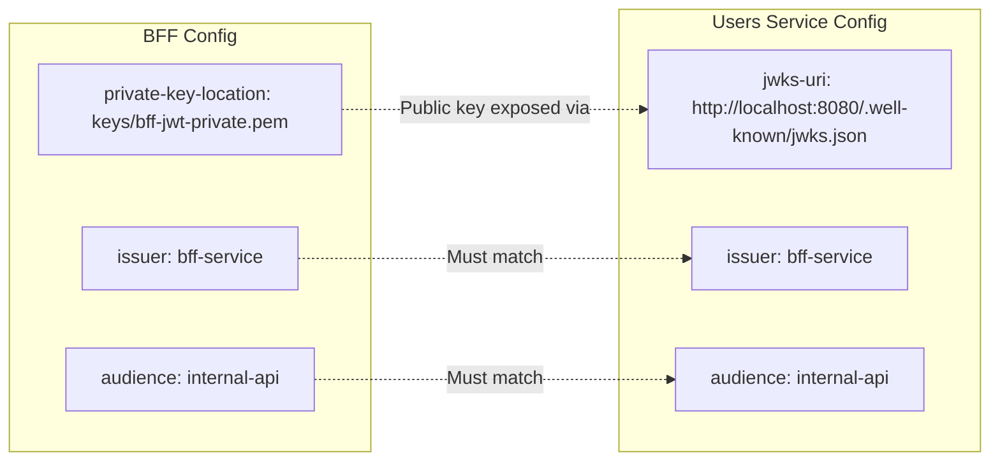

---

## File Reference

| File | Purpose |
|------|---------|
| `config/GatewayRoutesConfig.java` | Defines gateway proxy routes with filter chains |
| `config/SecurityConfig.java` | Spring Security setup, form login, in-memory users |
| `config/JwksKeyProvider.java` | Loads RSA keys, publishes JWK Set |
| `filter/InternalJwtRelayFilter.java` | Gateway before-filter: injects JWT into proxied requests |
| `filter/ProxyResponseHeadersFilter.java` | Gateway after-filter: adds traceability headers |
| `controller/CustomProxyController.java` | REST controller for custom proxy routes |
| `controller/RoleController.java` | Role selection and permission endpoints |
| `controller/JwksController.java` | Exposes `/.well-known/jwks.json` |
| `service/InternalJwtService.java` | Signs internal JWTs with RS256 |
| `service/CustomProxyService.java` | Executes custom proxy requests via RestClient |
| `service/RolePermissionService.java` | Fetches role permissions from config-service |
| `security/RoleAwareLoginSuccessHandler.java` | Post-login handler: applies role + permissions |
| `security/SecurityContextHelper.java` | Flattens permissions into SecurityContext authorities |
| `session/SessionKeys.java` | Session attribute constants and accessor |
| `util/CustomProxyUtils.java` | URI building, header management utilities |
| `exception/GlobalExceptionHandler.java` | Centralized error response formatting |
| `exception/ProxyRequestException.java` | Custom exception for proxy failures |
